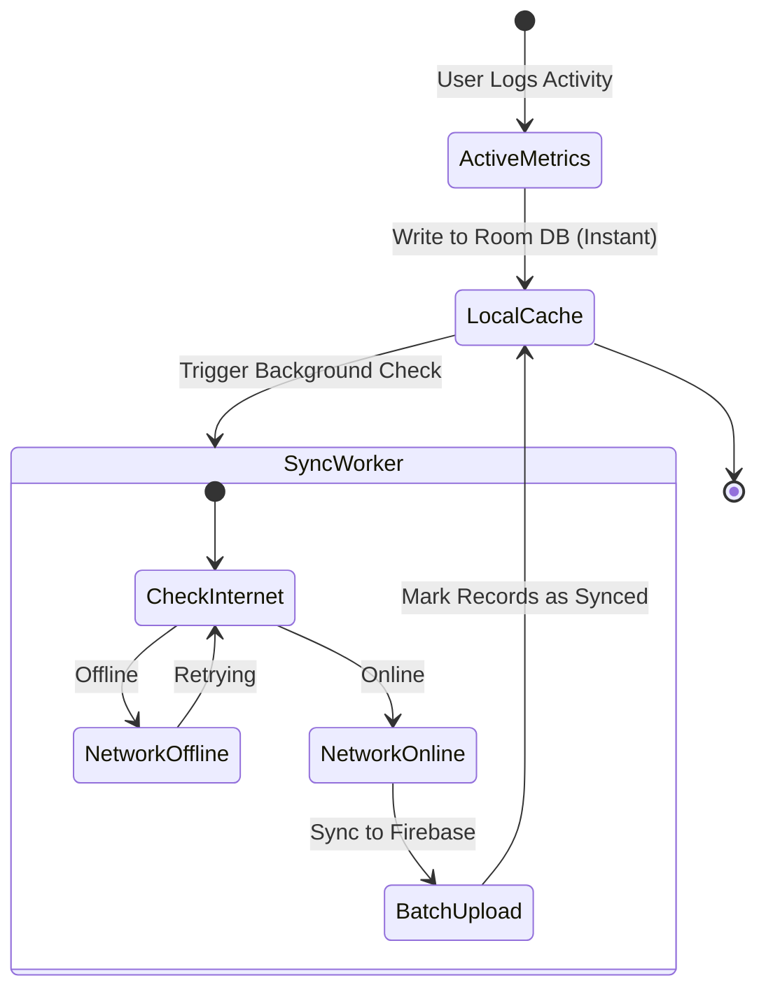

# 🏥 FitPulse: Offline-First Mobile Health Application

  
  
  
  
  

 

FitPulse is a mobile fitness tracking client designed to solve a critical real-world problem: tracking applications frequently lock up or lose user metrics when operating in low-connectivity areas (like basement gyms or remote running trails). FitPulse implements an offline-first state machine to ensure zero data loss.

---

> ### 🔒 Security & Intellectual Property Note
> This repository is a public UI/UX and architectural demo showcasing Compose layout structures and Room database models. **To protect proprietary workout indexing algorithms and user authentication secrets, the live synchronization handlers and Firebase API credentials are kept in a secure, private repository.** The local client layouts, state managers, and database schemas are open-sourced here for structural review.

---

## ✨ Features & Capabilities

*   **📱 Jetpack Compose Declarative UI**
    *   Responsive health dashboard displaying active minutes, steps, and hydration logs.
    *   Unidirectional data flows via structured ViewModels to guarantee screen states match underlying data.
*   **💾 Robust SQLite (Room) Caching**
    *   Writes all user metrics to a local SQLite cache instantly, avoiding network dependency.
*   **🔄 Automated Sync Protocol**
    *   Detects internet connection recovery in the background and batches data updates securely.
*   **🎨 Material 3 Design**
    *   Modern design system with fluid layout animations and micro-interaction states.

---

## 🛠️ Mobile Architecture Layers

| Layer | Component | Purpose |
| :--- | :--- | :--- |
| **Presentation** | Jetpack Compose + ViewModels | Drives interactive screen states and state flows. |
| **Domain** | Use Cases | Contains core fitness metrics logic, separating business rules from UI. |
| **Data** | Room DB + Repository | Manages local caching and serves as the single source of truth. |

---

## 📐 Offline-First Synchronization State Flow

---

## ⚙️ Project Structure Review

Open this project in Android Studio to review:
*   `/ui`: Compose layout systems, themes, and screens.
*   `/data`: Local Room Database definitions and entity configurations.
*   `/viewmodel`: Clean UI state flows with structured coroutine dispatchers.
